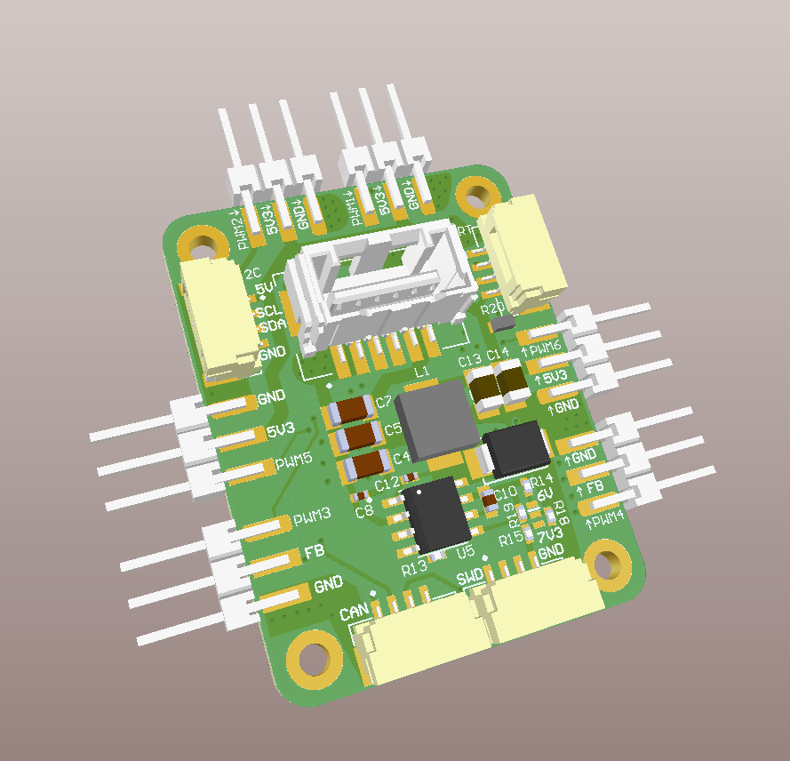

# Fuel tank DroneCAN application

> Developers docs: [DroneCAN template application](https://github.com/RaccoonlabDev/mini_v2_node/wiki/dronecan).

### 1. Key features

- You can run the software in SITL mode (don't need to have any hardware),

### 2. Brief hardware info

| View | Drw |
| ---- | ------ |
|  |  |

### 3. Application interface

The node measures fuel tank level with [AS5600](https://github.com/ZilantRobotics/libperiph/tree/master/sensors/encoder) and sends [FuelTankStatus](https://dronecan.github.io/Specification/7._List_of_standard_data_types/#fueltankstatus).

The node should measure with 10 Hz rate and publish data with 1 Hz rate.

The node has the following parameters:
- fuel.min_value (calibration value means 0% or fuel tank is empty),
- fuel.max_value (calibration value means 100% or fuel tank is full),
- fuel.volume (calibration value means total volume of a fuel tank).
